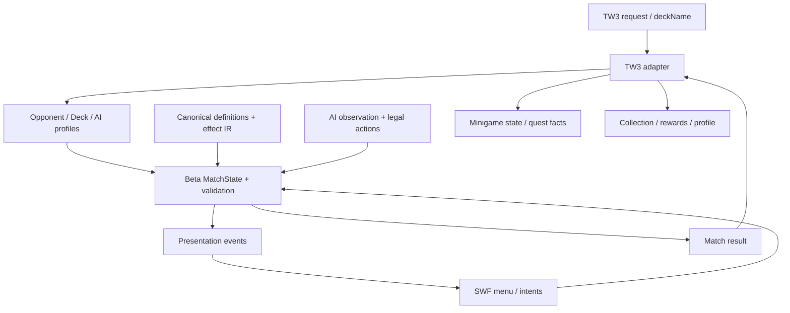

# Предлагаемая архитектура и backlog M4–M7

Статус: proposal под найденные TW3 conventions. REDkit 5.0 установлен, depot готов, проект — D:\w3mod\GwentB\myproject1. Script capability probe собран и исполнен; basic flat save/load и request/end hooks подтверждены. AS3→SWF→GFx тестовая сборка работает; native поле/меню/bridge и116/104 checks подтверждены; версия18 прошлаFLOW43; live DEV request intents наблюдались в20. Source/container findings — redkit_status.md.

[Черновик core](D:/w3mod/BetaGwent/README.md) перенесён в active project:22 sources, board-compile26 exit0/blob121531bytes. Подтверждён runtime предшествующей версии поля; 123 request assertions исполнены; FLOW43 приняты в18; ACTION39 и live DEV presentation приняты20; direct Apply20 принят21; manager86/queue regression требует native проверки. Полный матч и NPC адаптер ещё отсутствуют.

## Решение по runtime

Основной gameplay core реализовать в WitcherScript; data/спецификацию/генерацию/oracle tooling держать в workspace вне установленной игры. C# DIY и Unity client — references; Python backend не нужен single-player TW3. Нет доказанного стандартного runtime bridge TW3 → CLR, поэтому архитектура не должна зависеть от запуска DLL или внешнего сервера.

Цель: entry adapter сохраняет NPC/scene request и возвращает compatible result; Beta Core управляет всем матчем. SWF/presentation отправляет intents, получает events/view-model. Новое SWF menu, native registration и bridge проверены в REDkit на development fixture.

## Слои

| Слой | Ответственность / ограничения |
|---|---|
| Definitions | Immutable IDs/power/rarity/tier/categories/masks/ability graphs; version manifest |
| MatchState | Instances, owner/controller, zones/index, power layers, statuses, round/turn/pass, RNG state |
| Rules | Validate intent; legal actions для игрока и AI; explicit request contexts |
| Resolution | Actions, AbilityInstances, ExecutionStack/PlayStack, trigger comparator; никакой UI timing в правилах |
| Deck/Collection | Legal Beta decks, owned counts, selected deck, indexes search; separate vanilla IDs |
| AI | Public observation → generic evaluation/pass → mechanic knowledge → archetype → deck params |
| OpponentProfile | Existing deckName/NPC binding → fixed deck, AI, difficulty, reward |
| Rewards/Merchants | Data tables, first-win claims, duplicate policy, RPG gold/progression |
| Presentation | Intent/target requests, card view, animations; читает snapshots/events |
| Integration | NPC entry, menus/input/fade/audio, forced faction, outcome/quest compatibility |
| Save/Migration | Saved profile + schema, collection/decks/claimed rewards, safe initializer old save |

CardDefinition/runtime separation обязательна. Поддерживать owner и controller отдельно: изменение расположения/spying/charm не должно уничтожать идентичность оригинального владельца. Definition.Power ≠ runtime CurrentPower; у Beta есть PermanentPower.

## Import/IR

Read original ZIP → typed XML graph parser → normalized definitions + ability IR → coverage validator → generated WitcherScript/static resources. Сохранять Template ID, NId, graph node/connector ID, источник/hash и enum semantics. Raw flags оставить наряду с decoded representation.

Не начинать с ручного написания 900 card handlers. Core primitives должны следовать реальным nodes/actions, включая выбор и filters. Для vertical slice поддержать только необходимые типы; неизвестный node — error/unsupported, не silent skip. Полный interpreter всех 183 типов преждевременен.

Два engine implementations повышают цену parity. Если нужен desktop headless reference, использовать одинаковый generated IR и shared scenarios; C#/Python tooling не должен становиться единственным engine, который невозможно выполнить в TW3.

## AI и simulation

GetLegalActions/Validate/Apply — один путь для человека и AI. Observation исключает hidden opponent cards/deck order, кроме раскрытых правилами сведений. Clone/Apply для lookahead без view events/экономики. PassPolicy отдельна: round wins, cards, reach, engines/weather/carryover, remaining combo; difficulty меняет depth/evaluation/knowledge, не доступ к hidden state.

Batch runner: seed, decks/profiles, wins/loss/draw, card advantage, round count, action trace, illegal attempts, execution budget. DIY AITest показывает возможность одного матча, но не заменяет эту систему.

## Риски и открытые решения

- REDkit sources, depot и проект доступны; script patch/runtime/basic flat save-load подтверждены. Новый UI компилируется и экспортируется в GFx; .redswf/menu/bridge уже приняты; quest node properties/connections и canonical матч ещё нужны.
- Native CR4GwintManager имеет fixed vanilla data/API; не заполнять его Beta IDs вслепую.
- Win callback vanilla bool; vanilla AS collapses draw→loss. Beta core Draw сохранять отдельно, RPG policy реализовать и проверить через adapter.
- Original queue/stacks и reentrancy сложнее FIFO; эффектам нужен formal trace.
- Card counts/variants отличаются от ТЗ; сначала classify original pool.
- DIY IDs/balance и PDF2025 не canonical; использовать separate evidence/status.
- Original oracle клиент модифицируется patches, включая turn end; указывать active mod/mode.
- Script persistence доступна как convention, но размер и load behavior нового профиля не измерены.
- C#/Unity assets не исполняются/не загружаются в TW3 напрямую; нужен pipeline и UI experiment.

## Backlog с результатами приёмки

### Gates для проверенного M4

1. Проект найден: D:\w3mod\GwentB\myproject1\myproject1.w3edit; пользователь подтвердил depot ready. Полный editor validation остаётся отдельной проверкой при resource errors.
2. Compile/runtime/basic flat save round trip и Gwent hooks подтверждены. Нативное поле/меню/bridge принято; проверить interactive choices/targets и FLOW43 и конкретный quest graph. Не повторять basic gate без новой причины.
3. Закрыть original draw/mulligan/pass/winner/defaults и nested ordering для выбранных 10–20 карт.
4. Утвердить exact Beta decklists и minimal primitive coverage.

### M4 — минимальный core

- Definition/Instance/MatchState с stable IDs и separated owner/controller/power layers.
- State enum и conditional transitions из original spec.
- ValidateAction/LegalActions, target request + continuation.
- Seeded RNG interface с сериализуемым state; parity MT алгоритма до exact oracle RNG tests.
- Actions/trigger sort/stack, trace IDs, explicit invalid/unsupported results.
- Проверки: один детерминированный матч; illegal intent не меняет state; animation delay не меняет исход; nested ordering fixtures проходят.

Написаны state/snapshots/predicates/trigger insertion, development session/menu, typed requestState/requestContinuation. В проекте22 sources; board-compile26 успешен. Предыдущие116 core/104 board checks прошли в native runtime. 123 request checks прошли в15;18 ожиданий проверены exact copied IL. Найден switch128 diagnostic, в18 default исправлен. RequestFlow/FLOW43 assertions прошли в18. Queue boundary и39 checks написаны после original21 methods/36 observations; production ApplyAction ещё отсутствует. Original RNG23 метода/37 fixtures проверен отдельно; WitcherScript перенос отсутствует. API guards принадлежат ограниченному черновику. Header/views не заменяют registry/effect IR. RecordRoundResult не выполняет AfterRound/EndGame/ClearBoard. Полный FSM, resolution, event delivery/cancel/rollback, RNG предстоят; live DEV UI принят20; manager/driver26 ещё требует native suite, actual effects отсутствуют.

### M5 — импорт данных

- Parser original Templates/Abilities/CSV, masks/enums, source manifest.
- Typed graph IR, validation references/targets/localization/assets/decks/unknown nodes.
- Generated resources для согласованного минимального набора.
- Приёмка: повторный generation даёт одинаковый hash; coverage report 183 types; unsupported code не маскируется.

Созданы tools/import_beta924.py, data/beta924/manifest.json, normalized/catalog.json и coverage.json.698 templates/567 abilities/9713 ordered connections/RU+EN2231 keys; structural round trip и deterministic verify прошли. UInt64 masks сохраняются без потери точности; NId не считается глобальным ID. Все183 executable node types пока unsupported. Это structural catalog, не готовый semantic effect IR. Далее: typed semantic validation/slice coverage и BetaGwent/generated. [Описание](D:/w3mod/docs/beta_catalog.md).

### M6 — 10–20 оригинальных карт

- Две legal test decks и лидеры, exact original IDs и текст.
- Простые power/target mechanics → один engine → одна цепочка graveyard/trigger.
- На каждую механику исходное состояние/action/expected trace из original.
- Приёмка: нет зависимости от DIY balance, все required nodes реализованы и traces сравниваются.

Планируемые файлы: `data/beta924/slice.json`, `data/decks/slice/`, `tests/scenarios/cards/`, generated slice definitions.

### M7 — один NPC, полный цикл

- Intercept проверенный request, выбрать Beta deck, показать minimal board.
- Mulligan/target/pass/leader/rounds/graveyard/outcome; вернуть quest minigame state.
- Сохранить Beta profile; закрытие/forfeit, repeated request, input/fade/sound cleanup.
- Приёмка: normal win/loss, forced encounter, cancel, old save и save/load; quest выдаёт награду один раз.

Планируемые файлы: `BetaGwent/scripts/game/betagwent/{integration,profile,rewards,opponents}.ws`, minimal menu resources, isolated copies/hooks r4Player/deckBuilderMenu/gwintGameMenu по фактической точке интеграции. Не менять installed scripts или все NPC сразу.

M4 остаётся ограниченным черновиком; M5–M7 не завершены. Две DIY-доски, native bridge и input cleanup приняты пользователем и логами. Следующая проверка —suite39/20/86; реальные service adapters и effects ещё предстоят. Development fixture без эффектов не подменяет canonical slice или NPC цикл. Массовый перенос карт пока не начат.

## Текущее развитие28

Manager26 native accepted. Numeric28 is an installed raw final-setter boundary;
real power events/armor absorption/death remain separate services. Registry IDs
are UInt16 with LIFO reuse; template IDs Int32. Recycled ID alone is not forever
identity. Pending death sorts location/index descending, independently of trigger
priority; drain emits execution-stack actions. See beta_registry_death.md.
No full registry/canonical handlers/match/decks/AI acceptance yet.
